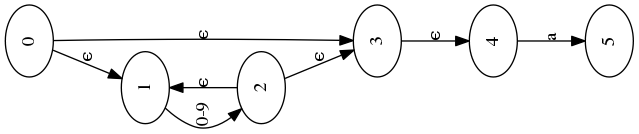

# regex-engine
<!-- TOC -->

- [regex-engine](#regex-engine)
    - [简介](#简介)
    - [编译环境](#编译环境)
    - [使用说明](#使用说明)
    - [程序结构](#程序结构)
    - [示例](#示例)
        - [Command-line](#command-line)
        - [图像生成](#图像生成)
    - [TODO](#todo)

<!-- /TOC -->

## 简介
这是一个简单的正则引擎，支持大部分纯正则表达式的语法。主要功能就是解析一个正则表达式，来得到一个自动机，并优化。然后根据这个自动机来对字符串来进行匹配，判断是否符合正则表达式。实现方式采用了`regex -> nfa -> dfa -> minimal dfa`的经典实现方式。

另外，为了更加直观地观察我们生成的自动机，借助于GraphViz工具，还实现了图形化NFA和DFA的功能。

## 编译环境

编译器： gcc 7.2.0


## 使用说明
建议在Linux环境下使用，或者使用Clion。
在主目录下使用`make`来直接编译，然后运行`regex-engine`。或者使用IDE来 import project。 输入正则表达式，然后输入字符串判断是否匹配。

对于输入的每个正则表达式，都会生成对应的图保存在graph目录下，但是只是`.dot`文件，需要使用GraphViz工具来生成图像。

如果需要生成图像，需要安装[GraphViz](https://www.graphviz.org/)这个程序。如果在Linux环境下安装，可以使用`sudo apt-get install graphviz`安装。

GraphViz根据dot文件来生成图像，`.dot`文件保存在graph目录下，使用命令`dot <filename> -T png -o graphname.png`来生成`.png`格式的图像。


## 程序结构
```
Regex expression ===> NFA ===> DFA ===> Minimal DFA ===> Recognizer
```

使用递归下降的方法来parse正则表达式，用Thompson算法构造出NFA。然后，使用子集构造算法从NFA构造出DFA。最后，使用Hopcroft’s Algorithm来简化DFA。利用最后得到的自动机，来进行匹配。

parse部分参考了[这篇文章](http://www.cs.sfu.ca/~cameron/Teaching/384/99-3/regexp-plg.html)的正则表达式语法描述:
```
<RE>	::=	<union> | <simple-RE>
<union>	::=	<RE> "|" <simple-RE>
<simple-RE>	::=	<concatenation> | <basic-RE>
<concatenation>	::=	<simple-RE> <basic-RE>
<basic-RE>	::=	<star> | <plus> | <elementary-RE>
<star>	::=	<elementary-RE> "*"
<plus>	::=	<elementary-RE> "+"
<elementary-RE>	::=	<group> | <any> | <eos> | <char> | <set>
<group>	::=	"(" <RE> ")"
<any>	::=	"."
<eos>	::=	"$"
<char>	::=	any non metacharacter | "\" metacharacter
<set>	::=	<positive-set> | <negative-set>
<positive-set>	::=	"[" <set-items> "]"
<negative-set>	::=	"[^" <set-items> "]"
<set-items>	::=	<set-item> | <set-item> <set-items>
<set-items>	::=	<range> | <char>
<range>	::=	<char> "-" <char>
```

- NFA的数据结构和构造NFA相关函数在nfa.h和nfa.cc中声明和实现
- DFA在dfa.h和dfa.cc中实现。
- Regex的parser在parser.h和parser.cc中实现

另外，`test/`中包含了对各个部分的测试。


## 示例
### Command-line
```
xvvx-regex> (a|b)c
string to match: ac
match!
xvvx-regex> ([a-z])+\*
string to match: abcde*
match!
xvvx-regex> (a?\?)?
string to match: a?
match!
```

### 图像生成
使用这段代码调用接口来生成图:
```
    //接口调用部分
    RegexParser parser;
    Nfa *nfa = parser.ParseToNfa("([0-9]*)a");
    graph_generator::GenerateGraph("example", nfa);
```
生成的`.dot`文件：
```
➜  RegexEngine git:(master) ✗ cat graphs/example.dot 
digraph example {
	0 -> 1 [label="ϵ"]
	0 -> 3 [label="ϵ"]
	1 -> 2 [label="0-9"]
	2 -> 1 [label="ϵ"]
	2 -> 3 [label="ϵ"]
	3 -> 4 [label="ϵ"]
	4 -> 5 [label="a"]
}%     
```
然后在shell中使用GraphViz工具：
```
 dot graphs/example.dot -Tpng -o graphs/example.png
```

最后在graphs目录下，可以看到我们生成的图像：



## TODO
- [ ] 用内存池来管理内存，NFA结点直接从内存池获取内存。
- [ ] 支持正向预查、反向预查、匿名捕获、命名捕获、边界和非贪婪重复等扩展正则表达式的功能。
- [x] 生成表示NFA和DFA的图像。